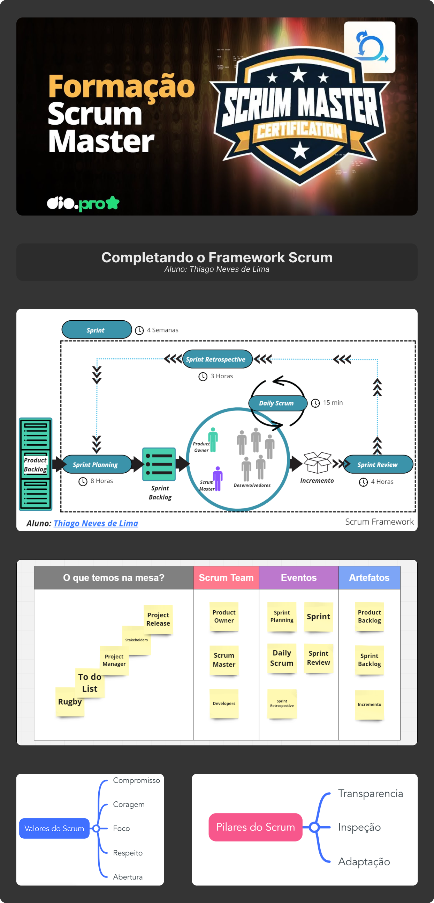

# DIO - Trilha Scrum Master
Completando o Framework Scrum
www.dio.me

## Contexto
Neste Desafio você assumirá o protagonismo e terá que completar o Framework Scrum. Ao final da jornada, você terá um material rico para estudo e compartilhamento com a comunidade. Sendo assim, os seus objetivos neste Desafio de Projeto serão: fixar os pilares e valores do Scrum, bem como reforçar os aspectos fundamentais do Framework Scrum: Responsabilidades, Eventos e Artefatos. 

[Link para os diagramas](https://miro.com/app/board/uXjVNW1kt9E=/?share_link_id=945902960701)

## Contato
 - [Linkedin](https://www.linkedin.com/in/thiago-de-lima-980977134/)
 - [YouTube](https://www.youtube.com/@thi-lima)
